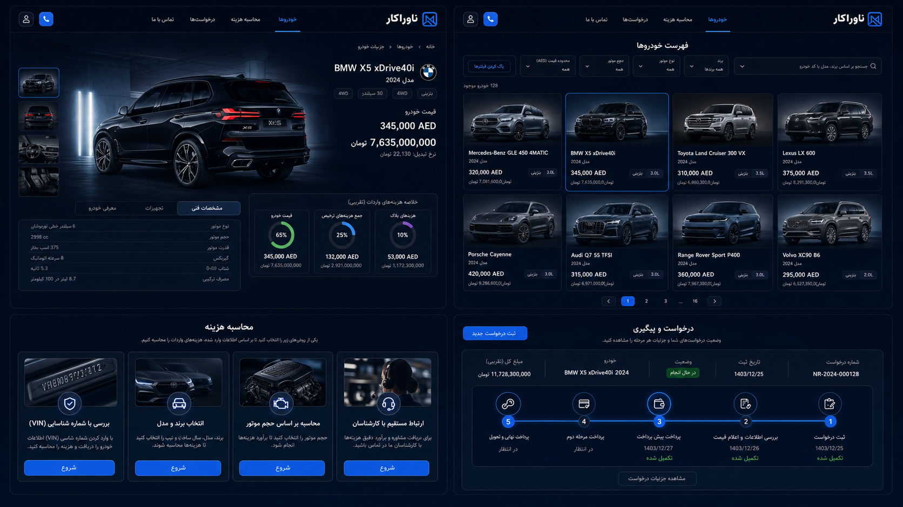
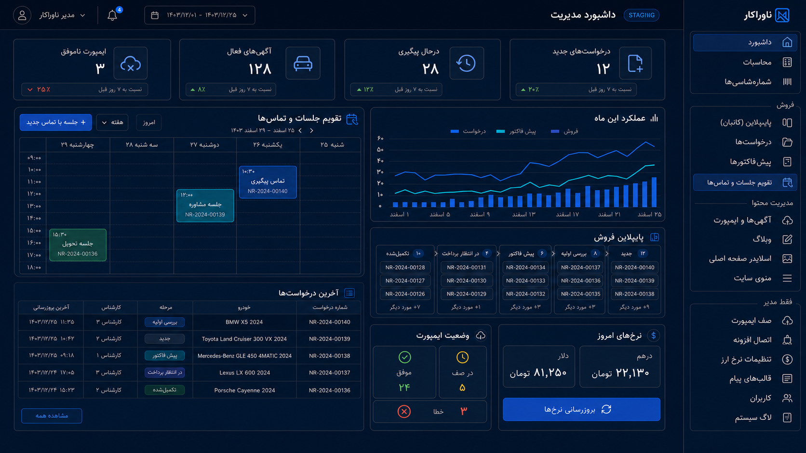
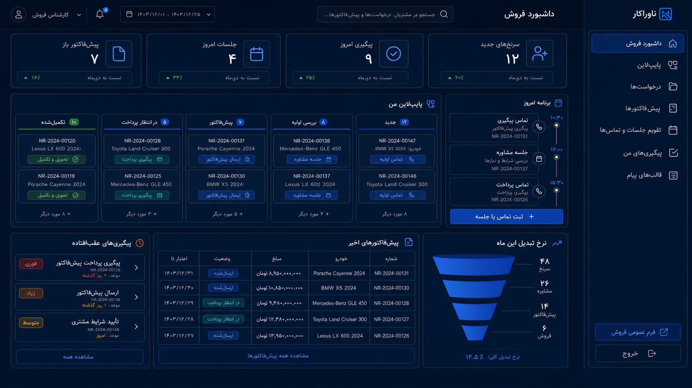
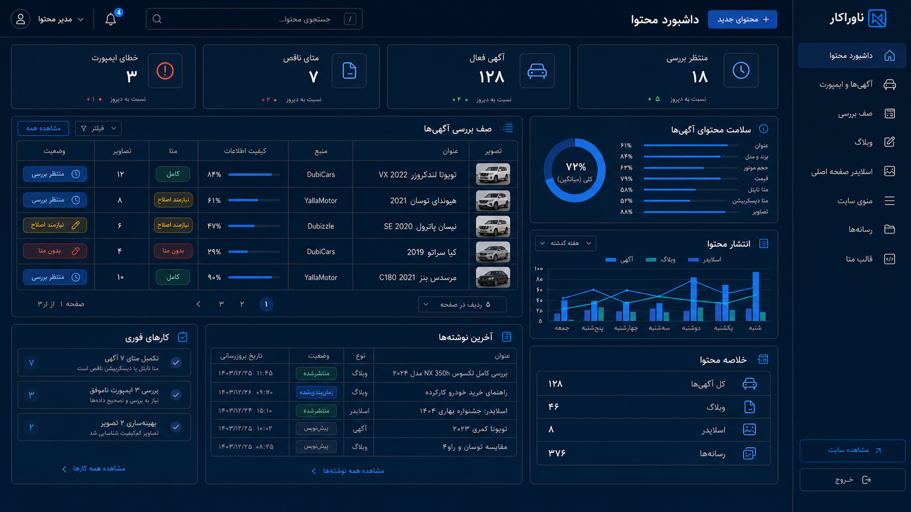
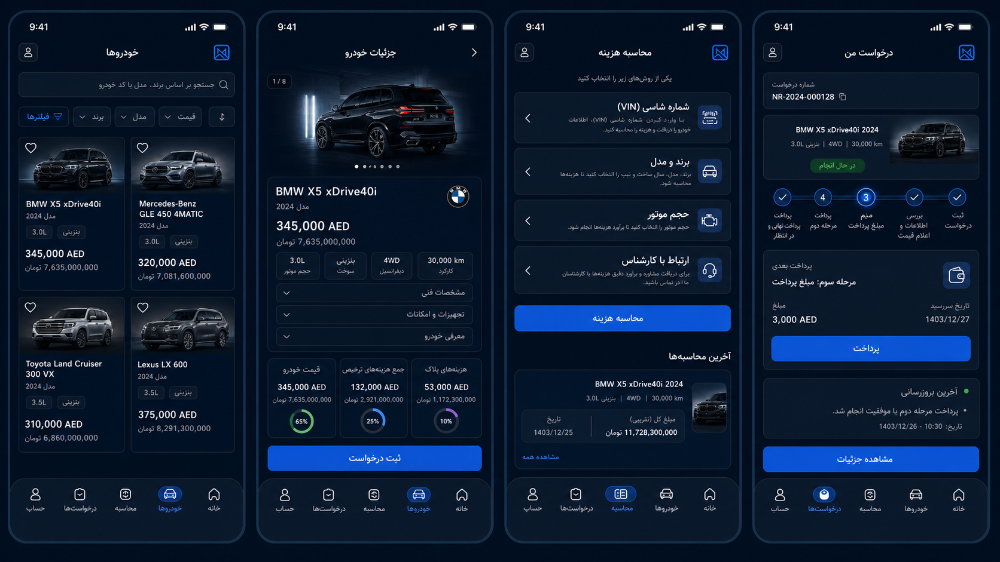
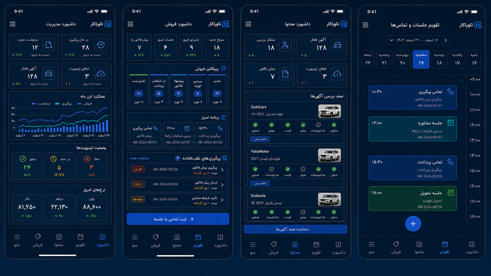
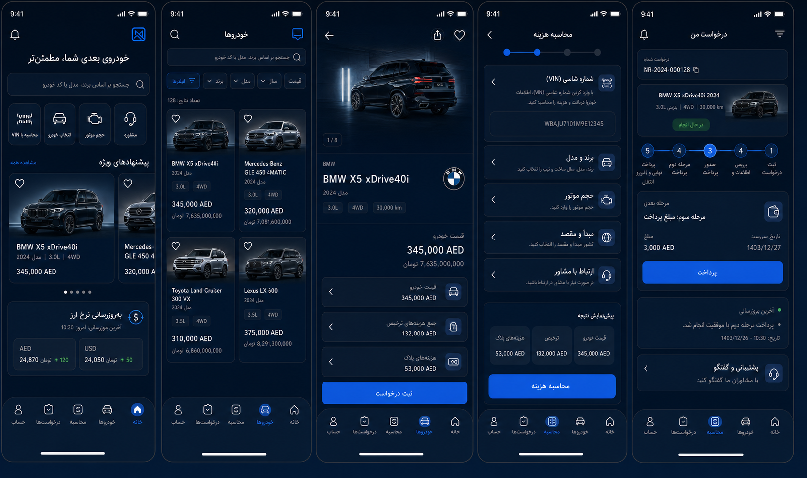

# پروژه طراحی نسخه جدید ناوراکار (V2)

**وضعیت:** تأییدشده برای اجرا

**تاریخ تأیید:** ۱۴۰۵/۰۵/۲۶ (2026-08-17)

**دامنه:** وب عمومی، پنل مدیریت، داشبورد فروش، داشبورد محتوا، وب واکنش‌گرا و نرم‌افزار Android

این پوشه مرجع رسمی طراحی نسخه جدید ناوراکار است. اجرای UI جدید باید بر اساس این سند، مشخصات فنی و تصاویر تأییدشده این پوشه انجام شود. این تأیید به‌خودی‌خود مجوز انتشار در Production نیست؛ مسیر انتشار همچنان `CI -> Staging -> تأیید مالک -> Production` است.

## ترتیب اعتبار منابع

در صورت تفاوت میان متن و تصویر، ترتیب زیر ملاک است:

1. الزامات مکتوب در [DESIGN_SPEC.md](DESIGN_SPEC.md)
2. قواعد کسب‌وکار و امنیت موجود در مخزن
3. تصاویر تأییدشده این پوشه
4. جزئیات تزئینی و داده‌های نمونه داخل تصاویر

تصاویر برای تعیین قالب، ترکیب‌بندی، تراکم اطلاعات و زبان بصری هستند. متن‌های ساختگی، اعداد نمونه یا خطاهای احتمالی رندر تصویر نباید به کد یا داده واقعی منتقل شوند.

## تصمیم‌های قطعی طراحی

- رابط Persian-first و کاملاً RTL است.
- زبان بصری اصلی: سرمه‌ای بسیار تیره، سطوح آبی-مشکی و تأکید آبی کبالت.
- رنگ نارنجی و بنفش جزو زبان اصلی V2 نیستند؛ سبز، زرد و قرمز فقط برای وضعیت‌های معنایی استفاده می‌شوند.
- کنترل‌های موبایل حداقل ۴۸ پیکسل/دپ ارتفاع قابل لمس دارند و صفحات نباید اسکرول افقی سند ایجاد کنند.
- نسخه موبایل، بازچینی واقعی اطلاعات است و نباید صرفاً نسخه کوچک‌شده دسکتاپ باشد.
- نرم‌افزار Android یک تجربه بومی Android است و WebView صرف محسوب نمی‌شود.
- تقویم جلسات و تماس‌ها جزو قابلیت‌های اصلی پنل مدیریت و فروش است.
- داشبورد محتوا باید کیفیت عنوان، برند/مدل، حجم موتور، قیمت، متا تایتل، متا دیسکریپشن و تصاویر را نمایش دهد.
- هزینه‌های قابل نمایش به کاربر و در نمودارها فقط این سه مورد هستند:
  1. قیمت خودرو
  2. جمع هزینه‌های ترخیص
  3. هزینه‌های پلاک
- عنوان یا ردیف جداگانه «کارمزد ترخیص‌کار و کارگزار (ناوراکار)» نباید در صفحات عمومی، جدول‌ها، مراحل پرداخت یا نمودارها نمایش داده شود.

## گالری مرجع تأییدشده

### وب عمومی دسکتاپ

### داشبورد مدیریت و تقویم

### داشبورد فروش

### داشبورد محتوا

### وب عمومی موبایل

### پنل مدیریت موبایل

### نرم‌افزار Android

## اسناد تکمیلی

- [مشخصات طراحی و رفتار صفحات](DESIGN_SPEC.md)
- [برنامه اجرای مرحله‌ای و معیارهای پذیرش](IMPLEMENTATION_PLAN.md)

## وضعیت پیاده‌سازی

این سند تأیید طراحی را ثبت می‌کند. پیاده‌سازی باید در PRهای کوچک و قابل بازبینی انجام شود و هیچ تغییر مهم رابط یا قاعده کسب‌وکار مستقیماً به Production نرود.
